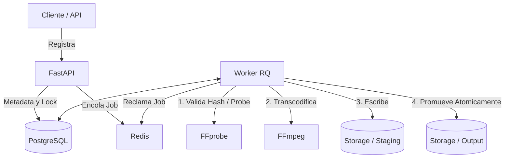
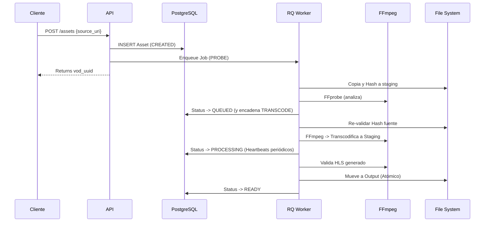
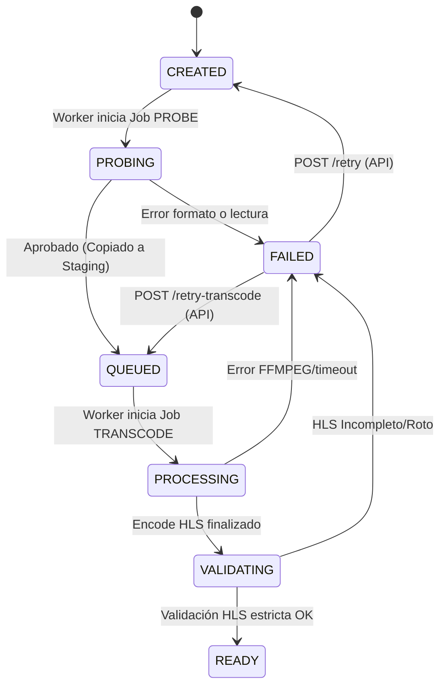
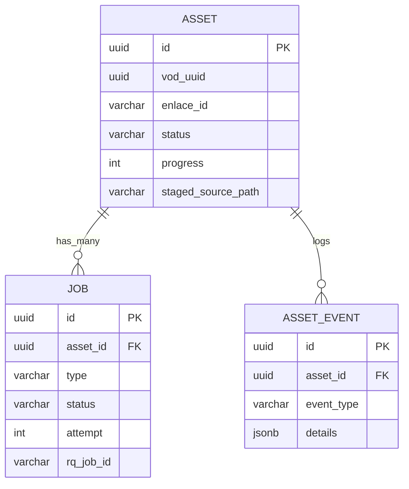

# Funcionamiento Actual del Sistema VOD (Fases 1, 2 y 3)

Este documento detalla el estado técnico-operativo de la plataforma de transcodificación de Video on Demand (VOD). Refleja el funcionamiento **real y actual** del sistema, incluyendo sus arquitecturas, flujos de procesamiento, herramientas, manejo de errores y estado de validaciones.

---

## 1. Resumen del Sistema

El sistema VOD es una plataforma asíncrona de ingestión, validación, transcodificación (HLS) y entrega de video. Su objetivo principal es asegurar que los archivos multimedia en bruto provistos sean transformados en escaleras adaptativas HLS para su consumo por el reproductor público.

### Componentes Principales

*   **FastAPI**: API REST encargada del registro inicial de activos (`Assets`), reintentos e interfaces administrativas.
*   **PostgreSQL**: Base de datos relacional y fuente primaria de verdad. Administra estados de video, trabajos, parámetros técnicos y el registro de eventos.
*   **Redis**: Bróker en memoria utilizado por RQ (Redis Queue) para la encolación de tareas asíncronas de los workers y métricas temporales de dashboard.
*   **RQ (Redis Queue) Worker**: Proceso desacoplado que ejecuta el flujo transaccional pesado: copiado de archivos, hash SHA-256, llamadas a codificadores.
*   **FFprobe / FFmpeg**: Herramientas subyacentes. *FFprobe* se utiliza para extraer dimensiones y códecs reales; *FFmpeg* procesa el stream en bruto y empaqueta el contenido a variantes M3U8 y segmentos TS.
*   **Almacenamiento Local (File System)**: Volumen de bloque responsable de gestionar el ciclo de vida del video, organizado en ingestión (`storage/input`), área de trabajo atómica (`storage/staging`) y publicación final servida por CDN (`storage/output`). Nginx puede exponer este último.



### Estado de Funciones

*   **Completamente implementado**: Ingestión referencial segura, copias idempotentes con validación hash (SHA-256), sonda FFprobe asíncrona, generación de HLS no distorsionado (escalas adaptativas evitando upscaling), timeout de FFmpeg con limpieza de hilos y subprocesos hijos determinista, validación HLS rigurosa, reconciliación post-publicación.
*   **Incompleto / Pendiente**: Endpoints de subida (Upload HTTP multipart), reemplazo de source (`/replace` implementado como stub HTTP 501), despliegue de front-end Dashboard UI, autenticación y SSL frontal nativo (actualmente recae en el proxy reverso o CDN externo).

---

## 2. Preparación del Entorno

El sistema depende de una infraestructura local básica expuesta mediante el archivo `.env`.

### Servicios Requeridos

1.  **PostgreSQL 14+**: Servicio de base de datos (`DATABASE_URL`).
2.  **Redis 6+**: Cola de mensajes y caché (`REDIS_URL`).
3.  **FFmpeg / FFprobe**: Accesibles por el PATH del sistema o indicados expresamente por `FFMPEG_PATH` y `FFPROBE_PATH`.

### Directorios

El worker y el servidor exigen la creación previa de directorios donde se operará (y permisos correspondientes). Se asume que `STAGING_ROOT` y `OUTPUT_ROOT` residen en el **mismo filesystem real** para permitir renombrado (movimiento atómico de i-nodes mediante `os.replace`):

*   `INGEST_ROOT=./storage/input` (Donde se colocan los videos fuente).
*   `STAGING_ROOT=./storage/staging` (Donde se procesan temp jobs y assets estables).
*   `OUTPUT_ROOT=./storage/output` (Directorio final público).
*   `LOG_ROOT=./storage/logs` (Ruta persistente de logs de FFmpeg para depuración y retención).

### Variables Críticas adicionales

*   `ADMIN_API_KEY`: Requerido para acceder a métricas `/admin/dashboard` y reintentos.
*   `HLS_VALIDATION_TIMEOUT_SECONDS=300`: Tiempo máximo comprobando los TS de un playlist.
*   `FFMPEG_TIMEOUT_SECONDS=14400`: (4 horas) Límite total de transcodificación tras el cual se enviará SIGTERM al proceso.

### Comprobaciones del Sistema

```bash
# Iniciar Base de Datos y Redis (e.g. docker-compose)
docker-compose up -d

# Migraciones
.venv/bin/alembic upgrade head

# Iniciar la API
.venv/bin/uvicorn src.main:app --reload

# Iniciar Worker
.venv/bin/python run_worker.py
```

---

## 3. Punto de Entrada del Video

Actualmente, **no existe una interfaz para subir archivos directamente mediante HTTP**. El diseño es de "Inplace Fetch". 

1.  El video (ej: `my_video.mp4`) debe copiarse manualmente al servidor en el directorio `INGEST_ROOT` (por defecto `./storage/input`).
2.  El archivo debe ser un contenedor multimedia válido (MP4, MOV).
3.  No se permiten rutas absolutas ni `../` hacia afuera de `INGEST_ROOT` (protección Path Traversal nativa `validate_ingest_path` lanza error 400).
4.  Si el archivo supera `MAX_FILE_SIZE_BYTES` (ej: 50GB), el worker aborta.

### Ejemplo de Solicitud de Ingestión

Si copiamos un video a `./storage/input/subcarpeta/video1.mp4`:

```bash
curl -X POST "http://localhost:8000/api/v1/assets" \
     -H "Content-Type: application/json" \
     -d '{
           "enlace_id": "ABC12345",
           "source_uri": "subcarpeta/video1.mp4"
         }'
```

La API devolverá un JSON similar a este:

```json
{
  "id": "123e4567-e89b-12d3-a456-426614174000",
  "vod_uuid": "123E4567-E89B-12D3-A456-426614174000",
  "enlace_id": "ABC12345",
  "source_uri": "subcarpeta/video1.mp4",
  "status": "created",
  "progress": 0,
  "created_at": "2026-08-04T12:00:00Z"
}
```

*   `enlace_id`: Un identificador de negocio unívoco provisto por un CMS.
*   `source_uri`: Ruta **relativa** a `INGEST_ROOT`.

La API devolverá un nuevo UUID (`vod_uuid`) para consultar su estado en `/api/v1/assets/{vod_uuid}`.

---

## 4. Flujo Completo de Procesamiento

El recorrido de un video involucra un acoplamiento entre eventos, base de datos y scripts de background (RQ):

1.  **Creación**: API (`src/api/routes.py`) inserta el activo en estado `CREATED` y encola un trabajo `PROBE`.
2.  **Validación de Fuente (`PROBE`)**:
    *   Worker (`src/worker/tasks.py:probe_and_prepare_job`) busca la ruta relativa. Comprueba permisos y seguridad.
    *   Copia los chunks del archivo hacia un temp (`source.part`) en `STAGING_ROOT/jobs/{job_uuid}/`.
    *   Genera un hash SHA-256 on-the-fly (`worker/core.py:secure_copy_and_hash`).
3.  **Extracción FFprobe**: Analiza resolución, codec y duración del `source.part`. Se persisten en PostgreSQL.
4.  **Promoción a staging estable**: Se mueve a `STAGING_ROOT/assets/{vod_uuid}/source.bin` usando atomicidad del filesystem (`os.replace`).
5.  **Encolamiento Transcode**: Si es exitoso, el asset pasa a `QUEUED` y automáticamente encadena un job `TRANSCODE`.
6.  **Pre-validación (`TRANSCODE`)**: Antes de transcodificar (`tasks.py:transcode_asset_job`), el script recalcula el hash del `source.bin` asegurando que no se manipuló el archivo, abortando con `E_SOURCE_HASH_MISMATCH` si falla.
7.  **Decisión del Ladder**: Se asigna escalera (1080, 720, 480, 360, "source" sin upscale) vía `src/worker/transcode.py`.
8.  **FFmpeg Run**: Se lanza subproceso de FFmpeg. Se envía el output a un archivo log bajo `LOG_ROOT/jobs/{job_uuid}/ffmpeg.log`.
    *   Un thread en el worker monitorea asíncronamente el log para el latido del heartbeat hacia PostgreSQL (evitando bloqueo del subproceso padre).
9.  **Timeout / Kill**: Si excede tiempo, envía `SIGTERM`. Si tras el periodo de gracia no termina, ejecuta `kill()` liberando el proceso.
10. **Validación Exhaustiva**: Al concluir, se inspeccionan playlists, códecs obligados (`avc1`, `mp4a`), y validaciones integrales (`src/worker/validation.py`). Asset pasa a `VALIDATING`.
11. **Publicación Atómica**: El contenido generado se traslada atómicamente a `OUTPUT_ROOT/EnlacePlus/...`. El estado se promueve a `READY` y se guarda `manifest_url`.



---

## 5. Máquina de Estados

La entidad central (`Asset`) obedece las siguientes transiciones.



Valores Reales (vía `src/models/enums.py`):
- `VideoStatus`: `CREATED`, `PROBING`, `QUEUED`, `PROCESSING`, `VALIDATING`, `READY`, `FAILED`.
- `JobType`: `PROBE`, `TRANSCODE`, `VALIDATE`.
- `JobStatus`: `PENDING`, `PROCESSING`, `COMPLETED`, `FAILED`.
- `EventType`: `TRANSITION`, `VALIDATION_FAILED`, `PROMOTED`, `ERROR`.

### Transiciones Reconciliables
El worker de `reconcile_jobs.py` inspecciona Redis y DB.
- Re-encola pasivos `PENDING` si se pierden del broker RQ de Redis.
- Falla jobs con estado temporal (como `PROCESSING`) cuyo *heartbeat* haya superado el timeout por duplicado.

---

## 6. Generación HLS

La estructura HLS está configurada estrictamente en `src/worker/transcode.py`.

*   **Sin Upscaling**: Si un archivo es 640x360, no se inventará una calidad 1080p. Se mapean solo las resoluciones iguales o inferiores (ej. 360p en variante `3`).
*   **Perfil Source**: Para orígenes inferiores a 360p, el escalador computa una proporción de bitrate reducida dinámicamente y crea una única variante `source` con resolución par para evitar desgarros de macrobloques. Se conservan proporciones, incluso para videos verticales.
*   **Audio Homogéneo**: AAC Muxed (128kbps, estéreo, 44.1kHz). Si la metadata arroja `has_audio=False` tras el PROBE, no se inserta pista vacía de audio; se remueve la obligación en la codificación HLS (soportado vía `src/worker/validation.py`).
*   **Ruta Output y Uppercase**: Todos los UUID del manifiesto HLS son normalizados a MAYÚSCULAS en el path.
    - Path Físico Output: `storage/output/EnlacePlus/_definst_/amlst:UUID-UPPER/ENLACE_ID/manifest.m3u8`
    - Path Físico Staging Temp: `storage/staging/jobs/JOB_UUID/hls/`

Estructura Resultante (Ejemplo):
```
storage/output/EnlacePlus/_definst_/amlst:1234-ABCD/MY_ID/
├── manifest.m3u8
├── v0/
│   ├── prog_index.m3u8
│   ├── segment_000.ts
│   └── segment_001.ts
└── v1/
    ├── prog_index.m3u8
    └── segment_000.ts
```

---

## 7. Validación del Resultado (HLS)

El proceso `src/worker/validation.py` es bloqueante e impone rigurosidad total:

*   **Parsing Estricto**: Decodifica `#EXT-X-STREAM-INF` del master manifest con un regex capaz de entender atributos separados por coma (ej. `CODECS="avc1.4d401f,mp4a.40.2"`).
*   **Decodificación FFprobe**: Ejecuta la sonda decodificadora sobre cada rendition generada (cada archivo TS). 
*   **Verificaciones Esenciales**:
    - Que el codec coincida (`mp4a` para audio si la fuente lo tiene, `avc1` para video H264).
    - Ancho de banda: Rechaza si supera el `BANDWIDTH_OVERHEAD_MAX_RATIO` (ej. 130% más allá del Target).
    - Bounding Box & Aspect Ratio: Falla si la resolución distorsiona las dimensiones excediendo `ASPECT_RATIO_TOLERANCE` (0.05).
    - Finalidad: El tag `#EXT-X-ENDLIST` debe existir en las sub-playlists indicando completitud.
*   **Fallos**: Cualquier discrepancia revienta el job arrojando `E_HLS_VALIDATION_FAILED` e impidiendo la publicación errónea a `OUTPUT_ROOT`.

---

## 8. Ubicación y Consumo de Terminados

Los archivos en `OUTPUT_ROOT` están expuestos normalmente vía web server Nginx. 

Si Nginx o CDN exponen la raíz física a través del subdominio de variables (`CDN_BASE_URL=https://videocdn.enlace.plus`), la URL construida será (con valores ficticios UUID `1234-ABCD` y enlace_id `MY_55`):

`https://videocdn.enlace.plus/EnlacePlus/_definst_/amlst:1234-ABCD/MY_55/manifest.m3u8`

**Para probar como administrador localmente:**
`ffplay http://localhost:8080/EnlacePlus/_definst_/amlst:1234-ABCD/MY_55/manifest.m3u8` (suponiendo que haya un proxy en el puerto 8080).

El `manifest_url` puede consultarse por el estado completo del activo: `GET /api/v1/assets/1234-ABCD`.

---

## 9. API Disponible

| Método | Ruta | Propósito | Auth | Entrada / Salida | Estado Actual |
|--------|------|-----------|------|------------------|---------------|
| POST   | `/api/v1/assets` | Ingesta de video a DB. | Ninguna | `source_uri` -> `vod_uuid` | Completado |
| GET    | `/api/v1/assets/{uuid}` | Consulta asset específico. | Ninguna | `uuid` -> `AssetResponse` | Completado |
| GET    | `/api/v1/assets/by-enlace/{id}`| Búsqueda por `enlace_id`. | Ninguna | `id` -> `AssetResponse` | Completado |
| POST   | `/api/v1/assets/{uuid}/retry` | Re-sonda desde `INGEST_ROOT`. | `ADMIN_API_KEY` | `uuid` -> Reactivación | Completado |
| POST   | `/api/v1/assets/{uuid}/retry-transcode`| Re-inicia directo usando la copia segura de staging. | `ADMIN_API_KEY` | `uuid` -> Reactivación | Completado |
| POST   | `/api/v1/assets/{uuid}/replace`| Reemplazo del fuente MP4. | Ninguna | **HTTP 501** | *Pendiente (Stub)* |
| GET    | `/admin/dashboard` | Métricas administrativas globales. | `ADMIN_API_KEY` | Headers -> Métrica global | Completado |
| GET    | `/admin/assets` | Paginación de Assets (`limit`, `offset`). | `ADMIN_API_KEY` | Filtro status -> Listado | Completado |
| GET    | `/admin/jobs` | Paginación de Jobs. | `ADMIN_API_KEY` | Filtro status -> Listado | Completado |

---

## 10. Dashboard Administrativo

El backend expone en `src/api/admin_routes.py` los conectores administrativos. 
**Importante: El front-end del dashboard aún no está construido en UI web.** Todo consumo es directo vía JSON-API.

*   **Autenticación**: `Require_admin_api_key` se encarga de interceptar y validar si el queryparam `admin_api_key` (o cabecera homónima) hace match con la env `ADMIN_API_KEY`. (Si la key de la BD está vacía, falla genéricamente devolviendo 401 Unauthorized).
*   **Métricas Presentadas (`/admin/dashboard`)**: Resume el `count` aglomerado en la base de datos para todas las enumeraciones del sistema (`status`), revisa la longitud profunda de Redis usando `rq.Queue.count`, workers vivos en Redis, identifica jobs "stale" (podridos o desfasados por falta de heartbeat), y devuelve una previsualización de las últimas 10 fallas en tiempo real.
*   **Manejo del Navegador**: El navegador/script del cliente debe inyectar manualmente la key.

---

## 11. Errores y Recuperación

| Código | Etapa | Significado | Estado Resultante | Recuperación |
|---|---|---|---|---|
| `E_SOURCE_HASH_MISMATCH` | `TRANSCODE` | Archivo modificado furtivamente. | `FAILED` | `/retry` (Desde Ingestión origen) |
| `E_HLS_VALIDATION_FAILED`| `VALIDATING`| Resultado final con códecs rotos. | `FAILED` | `/retry-transcode` |
| `E_FFMPEG_TIMEOUT` | `PROCESSING`| Worker colgado más de 4 horas. | `FAILED` | `/retry-transcode` |
| `E_JOB_RECONCILED` | `RECONCILE` | El job murió por pérdida de worker (o no dio latido). | `FAILED` | Automático (El cron lo re-encolará/fallará). |
| `E_ATOMIC_PROMOTION_FAILED` | `PROMOTING` | Nginx/Filesystem retiene lock en directorio final. | `FAILED` | `/retry-transcode` tras destrabar fuser. |

---

## 12. Reconciliador (`reconcile_jobs.py`)

Herramienta de limpieza desatendida fundamental para la consistencia estado/Redis:

*   **Modo Ejecución**: Es un script python invocable (`python -m src.scripts.reconcile_jobs`).
*   **Limpieza de Staging** (`reconcile_staging`): Escanea UUID huérfanos generados en staging. Si se invoca `--clean-staging`, emplea una limpieza recursiva severa comprobando primero la seguridad de las rutas.
*   **Reparador de Tareas** (`reconcile_jobs`): Bloquea DB por microsegundos, interroga a Redis por el ID del Job RQ. Si lo encuentra "started" pero sin actualizaciones recientes lo apuñala (failing). Si se esfumó y su DB marca PENDING, lo reinicia.
*   **Limitaciones de `reconcile_published_assets`**: **RIESGO ACTUAL.** Este módulo salva activos caídos a FAILED detectando si tienen el archivo `manifest.m3u8` en el storage final. Sin embargo, **solo comprueba su existencia en el disco**, omitiendo la validación exhaustiva de TS internos. Un HLS interrumpido a la mitad donde el manifiesto M3U8 alcanzó a persistir sería falsamente categorizado a `READY`.

---

## 13. Operación y Monitorización

*   **Endpoints Health**: (Punto pendiente, dependerá del load balancer en Nginx si se anexa una capa `/health`).
*   **Espacio Mínimo (`MIN_FREE_DISK_BYTES`)**: 1 GB forzado vía config.
*   **Alerta recomendada**: Escalar métrica `/admin/dashboard` al valor `stale_jobs > 0` o `depth > 10`. 
*   **Identificación en Consola**: Cada vez que el transcode corre, loguea agresivamente a la carpeta respectiva dentro de `storage/logs/jobs/.../ffmpeg.log`.

---

## 14. Persistencia (Modelo de Datos Relacional)

La base de datos relacional aloja un histórico completo del ciclo de vida.



*   **Fuente de la verdad**: PostgreSQL es amo y señor. Redis debe ser borrable (ephemeral flushable). Si Redis se cae, la DB proveerá un recupero (PENDING).
*   **Cualidad Especial**: Las iteraciones o `attempts` residen y se incrementan en PostgreSQL por `Job`. Si falla 3 veces la transcodificación, el Asset muere definitivamente (`MAX_TRANSCODE_ATTEMPTS = 3`).

---

## 15. Pruebas y Estado Actual

Inspección de la suite mediante `pytest -q`:

*   **Resultados Directos**: `55 passed, 4 warnings in 11.87s`. Todas las pruebas compilan e incluyen pruebas complejas asíncronas de integración y latidos de corazón mockeados. 
*   **Casos Cubiertos (Reales y Fixtures)**:
    - MP4 de 320x240 (Verificación obligatoria sin upscale).
    - Orígenes sin canales de Audio (Manejados estrujando `#EXT-X-STREAM-INF` correctamente).
    - Orígenes Verticales (1080x1920) y Múltiples formatos en escalera.
    - Subprocesos Hilos zombies limpiados mediante iterador Event.
*   **Migraciones**: `alembic check` reporta `No new upgrade operations detected.`. Completamente saneado.

---

## 16. Operación Unificada (`vod.sh`) y Procesamiento

El MVP se controla enteramente mediante un único script de gestión que asegura dependencias, inicialización, migraciones y levantamiento simultáneo de los servicios.

### Comandos Disponibles

```bash
./vod.sh start    # Inicia Docker, migraciones, API (Uvicorn) y Worker (RQ) en background
./vod.sh status   # Muestra la salud de los servicios, puertos, PIDs y trabajos en cola
./vod.sh logs     # Monitorea unificadamente API, Worker y el log principal de VOD
./vod.sh stop     # Detiene los procesos Python y apaga los contenedores Docker
./vod.sh ingest <archivo>  # Envía un archivo a procesar extrayendo el ID automáticamente
```

### Tutorial: Procesar Primer Video

```bash
# 1. Preparar las carpetas operativas base.
mkdir -p storage/input storage/staging storage/output storage/logs

# 2. Configurar entorno.
cp .env.example .env
# Revisa las variables en .env, asegurando que existen

# 3. Colocar un archivo en storage/input
cp ~/Descargas/mi_sermon.mp4 ./storage/input/mitest.mp4

# 4. Iniciar toda la infraestructura unificada
./vod.sh start

# 5. Ingestar el video al sistema (calcula enlace_id "mitest" y source_uri "mitest.mp4")
./vod.sh ingest mitest.mp4

# 6. Monitorear progreso (o usar API: /api/v1/assets/...)
./vod.sh status
./vod.sh logs

# 7. Reproducir (cuando termine el transcode y se mueva a output)
ffplay storage/output/EnlacePlus/_definst_/amlst:<UUID>/mitest/manifest.m3u8

# 8. Apagar infraestructura (preserva la BD y Redis intactos)
./vod.sh stop
```

---

## 17. Limitaciones y Próximos Pasos

### Limitaciones Confirmadas
- **UI Inexistente**: Toda la administración ocurre a través de JSON/CURL. El `/admin/dashboard` no provee una plantilla web.
- **Falta Validación Integradora de Reconciliación**: El script de recuperación post-publicación asume validez total si existe el `manifest.m3u8`, ignorando posibles transcodificaciones HLS canceladas intempestivamente a la mitad de su ejecución de segmentos.
- **Sin interfaz nativa Upload File**: El método actual asume un volumen montado para `storage/input`. Esto no es ideal a largo plazo y la API debería soportar `multipart/form-data`.
- **Ruta de reempaquetado /replace**: Aún retorna `HTTP 501`.

### Mejoras Recomendadas para Producción
- Finalizar endpoint de subida (File Upload) directamente a Staging, mitigando el `INGEST_ROOT` on-premise si se mueve a la nube el cluster API.
- Re-introducir el parseo asíncrono exhaustivo `validate_hls_output` (o una versión rápida `ffprobe`) cuando el reconciliador trate de salvar un activo `FAILED`.
- Enmascarar la API detrás de un proveedor que provea SSL.
- Exponer métricas vía formato **Prometheus** (ej. `GET /metrics`) en lugar del payload custom `/admin/dashboard` para integración inmediata en tableros de Grafana con alertas.
- Configurar Jobs cronometrados programados (ej. crontab o scheduler embebido) para correr recurrentemente `.venv/bin/python -m src.scripts.reconcile_jobs --clean-staging`.
